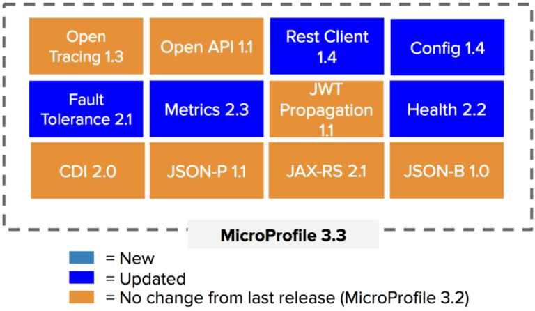

= Quarkus workshop - Redpill Linpro

En workshop om https://quarkus.io/[Quarkus] afholdt af https://www.redpill-linpro.com/[Redpill Linpro].

I denne workshop vil vi efter en introduktion til https://quarkus.io/[Quarkus] lave en simpel todo microservice.

Vores microservice vil hente og gemme data i en database (https://www.postgresql.org/[Postgres]) via CRUD, vi vil se på den indbyggede health, metrics og openapi.

Hvis tiden tillader det, vil vi tage et kik på https://quarkus.io/guides/hibernate-orm-panache[panache] fra https://quarkus.io/[Quarkus].

*Formen* i denne workshop bliver at instruktøren driver workshoppen ved at kode den endelige løsning, mens deltagerne kan kode med eller hente den færdige løsning. Der vil være rig mulighed for at stille spørgsmål undervejs.

*Målgruppen* for denne workshop er primært udviklere, men andre it-kyndige personer vil også kunne få udbytte, da vi ikke fordyber os i koden.

Design pattern in the todo application - Boundary-Control-Entity.

== Introduktion til Quarkus

* Wildfly team
* `A Kubernetes Native Java stack tailored for OpenJDK HotSpot and GraalVM, crafted from the best of breed Java libraries and standards.`
* Java (started in 1.480s)
* Native (started in 0.068s)
* Created and supported by Red Hat

Supersonic Subatomic Java

Project website : https://quarkus.io/

Start coding : https://code.quarkus.io/

Guides : https://quarkus.io/guides/

Guides for this application

- https://quarkus.io/guides/rest-json
- https://quarkus.io/guides/hibernate-orm
- https://quarkus.io/guides/hibernate-orm-panache
- https://quarkus.io/guides/microprofile-health
- https://quarkus.io/guides/microprofile-metrics
- https://quarkus.io/guides/openapi-swaggerui
- https://quarkus.io/guides/opentracing

== Requirements

- Java 11
- Graalvm 20.3.1
- Postgres
- Jaeger
- https://github.com/Konloch/bytecode-viewer[Bytecode Viewer]

=== Graalvm

https://github.com/graalvm/graalvm-ce-builds/releases[Download page] for GraalVM Community Edition.

https://www.graalvm.org/docs/getting-started/#install-graalvm[Install GraalVM]

=== Postgres

Start postgres with docker

[source,bash]
----
docker run -it --rm=true \
	--ulimit memlock=-1:-1 \
	--memory-swappiness=0 \
	--name PostgreSQLWorkshop \
	-e POSTGRES_USER=hibernate \
	-e POSTGRES_PASSWORD=hibernate \
	-e POSTGRES_DB=hibernate_db \
	-p 5432:5432 postgres:13.1
----

Start postgres with podman

[source,bash]
----
podman run -it --rm=true \
	--memory-swappiness=0 \
	--name PostgreSQLWorkshop \
	-e POSTGRES_USER=hibernate \
	-e POSTGRES_PASSWORD=hibernate \
	-e POSTGRES_DB=hibernate_db \
	-p 5432:5432 \
	postgres:13.1
----

=== Jaeger

Start Jaeger with docker

[source,bash]
----
docker run -it --rm=true \
  -p 5775:5775/udp \
  -p 6831:6831/udp \
  -p 6832:6832/udp \
  -p 5778:5778 \
  -p 16686:16686 \
  -p 14268:14268 \
  jaegertracing/all-in-one:1.21
----

Start Jaeger with podman

[source,bash]
----
podman run -it --rm=true \
  -p 5775:5775/udp \
  -p 6831:6831/udp \
  -p 6832:6832/udp \
  -p 5778:5778 \
  -p 16686:16686 \
  -p 14268:14268 \
  jaegertracing/all-in-one:1.21
----

== Byg en microservice (ToDo app)

Modellen vi bygger vores service op omkring

[source,java]
----
public class ToDo {
    public String subject;
    public String body;
}
----

== Bootstrapping the project

[source,bash]
----
mvn io.quarkus:quarkus-maven-plugin:1.11.1.Final:create \
    -DprojectGroupId=dk.jarry \
    -DprojectArtifactId=todo-app \
    -DclassName="dk.jarry.todo.boundary.ToDoResource" \
    -Dpath="/todos"
cd todo-app
----

== Build and running App

* Structure of quarkus-workshop* 
| quarkus-workshop
- | todo-app-st
  - ...
- | todo-app-st
  - mvnw	
  - pom.xml
  - README.adoc
  - | src
  - | target
    - todo-app-1.0.0-SNAPSHOT-runner
	- todo-app-1.0.0-SNAPSHOT-runner.jar
	- todo-app-1.0.0-SNAPSHOT.jar
	- | lib
	  - *.jar

=== Maven

Build and run in dev mode
[source,bash]
----
./mvnw compile quarkus:dev
----

Build java version
[source,bash]
----
./mvnw clean package
----

Build native version
[source,bash]
----
./mvnw package -Pnative
----

Run java version
[source,bash]
----
java -jar target/quarkus-workshop-todo-app-1.0.0-SNAPSHOT-runner.jar
----

Run nativ version
[source,bash]
----
./target/quarkus-workshop-todo-app-1.0.0-SNAPSHOT-runner
----

This will need an OS - it contains all need - app and jdk.  

=== Postgres

From application.properties

----
quarkus.datasource.db-kind=postgresql
quarkus.datasource.jdbc.url=jdbc:postgresql://PostgreSQLDemo:5432/hibernate_db
quarkus.datasource.jdbc.driver=org.postgresql.Driver
quarkus.datasource.username=hibernate
quarkus.datasource.password=hibernate
quarkus.datasource.jdbc.max-size=8
quarkus.datasource.jdbc.min-size=2

quarkus.hibernate-orm.database.generation=update
----

=== H2 (alternativ to Postgres)

From application.properties

----
# "jdbc:h2:mem" doesn't work in native mode, but native mode uses %prod properties
quarkus.datasource.db-kind=h2
quarkus.datasource.jdbc.url=jdbc:h2:mem:hibernate_db

quarkus.hibernate-orm.database.generation=update
----

== MicroProfile

 

https://quarkus.io/blog/tag/microprofile/[Blogs about Quarkus and MicroProfile]

- https://quarkus.io/blog/quarkus-eclipse-microprofile-3-3/[Quarkus 1.3 and Eclipse MicroProfile 3.3]

=== MicroProfile Health

http://localhost:8080/health

http://localhost:8080/health-ui/ (Not part of MicroProfile)

[source,bash]
----
curl -X GET \
	http://localhost:8080/health \
	-H 'Accept: application/json' 
----

https://quarkus.io/guides/health-guide[quarkus.io - Health Guide]

=== MicroProfile Metrics

http://localhost:8080/metrics/application

[source,bash]
----
curl -X GET \
	http://localhost:8080/metrics/application \
	-H 'Accept: application/json' 
----

https://quarkus.io/guides/metrics-guide[quarkus.io - Metrics Guide]

=== OpenAPI and SwaggerUI

- http://localhost:8080/openapi[OpenAPI]
- http://localhost:8080/swagger-ui[swagger-ui]

OpenAPI and Swagger-UI only works in dev and test mode. 

If you want to make it available in production too, you can include the following configuration in your application.properties:

----
quarkus.swagger-ui.always-include=true
----

[source,bash]
----
./mvnw compile quarkus:dev
----

https://quarkus.io/guides/openapi-swaggerui-guide[quarkus.io - OpenAPI SwaggerUI Guide]

=== Opentracing

You can then navigate to http://localhost:16686 to access the Jaeger UI.

https://quarkus.io/guides/opentracing[quarkus.io - Using OpenTracing]

== Panache

[source,java]
----
@Entity
public class ToDo extends PanacheEntity {

    public String subject;
    public String body;

}
----

== Test from comman line

Create
[source,bash]
----
curl -X POST http://localhost:8080/todos \
	-H 'Accept: application/json' \
	-H 'Content-Type: application/json' \
	-d '{"subject":"Hello from Quarkus","body":"Content"}'
----

Read id 10
[source,bash]
----
curl -X GET "http://localhost:8080/todos/10" -H "accept: application/json"
----

Update id 10
[source,bash]
----
curl -X PUT http://localhost:8080/todos/10 \
	-H 'Accept: application/json' \
	-H 'Content-Type: application/json' \
	-d '{"subject":"Updated Hello from Quarkus","body":"Content"}'
----

Delete id 10
[source,bash]
----
curl -X DELETE "http://localhost:8080/todos/10" -H "accept: application/json"
----

Read from 0 to 100
[source,bash]
----
curl -X GET "http://localhost:8080/todos?from=0&limit=100" -H "accept: application/json"
----

== Parts in workshop

=== todo-app-steep1

* bootstrapping the project
* look into the file structure
* We will have a look into `quarkus-todo-app-1.0.0-SNAPSHOT-runner.jar` to see what happens behind the screen.
* add configuration (`@ConfigProperty`)

link:todo-app-steep1/README.adoc[todo-app-steep1/README.adoc] 

=== todo-app-steep2

* add more extensions
* config postgresql
* add a service to our boundary

link:todo-app-steep2/README.adoc[todo-app-steep2/README.adoc] 

=== todo-app-steep2-h2

* use h2 instead of postgresql

link:todo-app-steep2-h2/README.adoc[todo-app-steep2-h2/README.adoc]

=== todo-app-steep2-panache

* use panache in ToDoService

link:todo-app-steep2-panache/README.adoc[todo-app-steep2-panache/README.adoc] 

=== todo-app-steep3

* add more extensions
* have a look into smallrye
	- smallrye-opentracing
	- smallrye-openapi
	- smallrye-health
	- smallrye-metrics

link:todo-app-steep3/README.adoc[todo-app-steep3/README.adoc] 

=== todo-app-steep4

Add

 - DemoHealthCheck
 - @Traced -> ToDoService
 - @Counted -> ToDoResource
 - @Timed -> ToDoResource
 - @Operation -> ToDoResource

link:todo-app-steep4/README.adoc[todo-app-steep4/README.adoc] 

=== todo-app-st

This projec is the System Test (st) of our todo-app.

Demonstrates `@QuarkusTest` - CDI.

Containg

* main
	- ToDoResourceClient

* test
	- ToDoResourceTest

link:todo-app-st/README.adoc[todo-app-st/README.adoc] 
